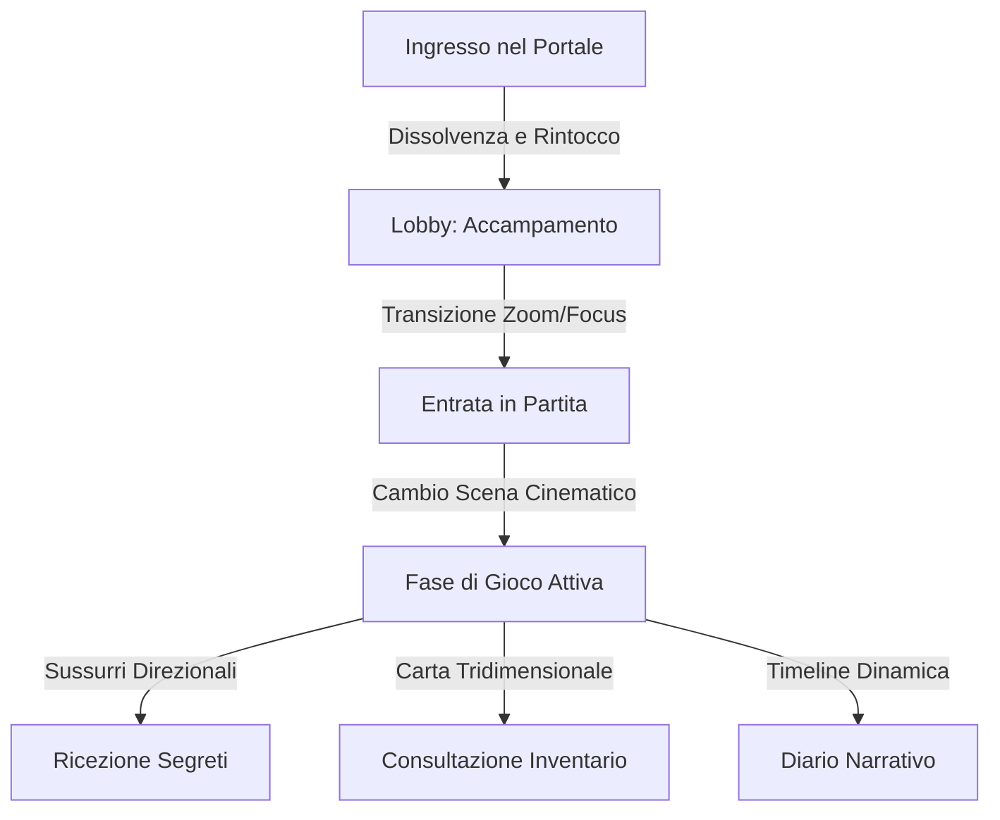

# GDR Master Room: Studio di Visione e Progettazione AAA
*Analisi strategica e direzione artistico-creativa per l'evoluzione in Piattaforma Narrativa di Nuova Generazione*

**Autori (Il Comitato AAA):**
*   **AAA Game Director**: Definisce la visione olistica del prodotto e i criteri di qualità percepita.
*   **Creative Director**: Protegge l'identità intellettuale, il tono e il coinvolgimento tematico dell'esperienza.
*   **Narrative Director**: Cura il fluire degli eventi, il dramma dei personaggi e gli strumenti di storytelling.
*   **Senior Game Designer**: Sviluppa le regole, i sistemi di interazione, la progressione e le meccaniche di gioco.
*   **Senior UX Designer**: Ottimizza il carico cognitivo, le mappe mentali dell'utente e la facilità di fruizione.
*   **Senior UI Designer**: Disegna gli elementi visuali del "HUD", l'integrazione stilistica e la coerenza diegetica.
*   **Cinematic Director**: Dirige i tempi, le transizioni visive, i movimenti di camera e i picchi drammatici.
*   **Audio Director**: Cura il soundscape, la musica dinamica adattiva e il feedback sonoro di interfaccia.
*   **Art Director**: Coordina lo stile visivo generale, le palette cromatiche, i filtri e l'atmosfera visiva.
*   **Virtual Tabletop Expert**: Coniuga le esigenze tecniche del VTT con le funzionalità pratiche di gioco.

---

## 💬 Tavola Rotonda dei Director: L'Incipit
> **Game Director**: *"Signori, l'obiettivo odierno non è raffinare uno strumento. I nostri concorrenti hanno già fogli di calcolo glorificati e chat di messaggistica standard. Noi stiamo progettando l'equivalente di un RPG AAA. Voglio che quando il Master preme 'Cambia Scena', i giocatori trattengano il fiato. Voglio che un sussurro provochi brividi reali sulla schiena del destinatario. Dobbiamo eliminare la freddezza della dashboard di amministrazione ed entrare nell'era del videogioco narrativo immersivo."*
> 
> **Art Director**: *"Concordo. Dobbiamo smettere di pensare a pixel dritti e sfondi piatti. La luce, l'ombra, le texture organiche e la profondità devono governare lo schermo."*
> 
> **Audio Director**: *"E il silenzio deve sparire. L'interfaccia deve suonare, sussurrare, respirare insieme ai giocatori."*

---

## 📊 1. ANALISI GENERALE: Dashboard, Chat o Gioco AAA?

Se un giocatore entrasse oggi nell'applicazione, la percezione immediata sarebbe quella di una **dashboard gestionale a tema scuro con funzionalità di chat avanzata**, piuttosto che un vero gioco narrativo AAA.

### I Motivi (Analisi del Comitato):

1.  **Frammentazione Visiva Geometrica (Senior UI/UX)**:
    L'interfaccia è suddivisa in "box" rigidi, netti ed isolati. La chat è un rettangolo statico, il pannello delle azioni è un modulo, e lo stage delle immagini è racchiuso da margini geometrici uniformi. Questa separazione fa percepire l'applicazione come un client software di produttività (stile Slack o Trello) piuttosto che come uno spazio di gioco coeso.
2.  **Staticità e Assenza di Micro-Interazioni (Cinematic Director)**:
    Un videogioco AAA si muove costantemente. Anche quando il giocatore è fermo, ci sono particelle di polvere nell'aria, bagliori luminosi soffusi, o leggeri respiri negli elementi dell'interfaccia. Attualmente, l'app è immobile: i cambi di stato (come l'apparizione di un'immagine o di un testo) avvengono in modo istantaneo e secco, rompendo la sensazione di un mondo vivo.
3.  **Il Silenzio Clinico dell'Interfaccia (Audio Director)**:
    Non esiste feedback sonoro per i pulsanti, per le aperture dei menu o per l'invio dei messaggi. La mancanza di un'identità acustica dell'UI relega lo strumento a una "pagina web". Nei titoli AAA, il clic di selezione ha un peso acustico ben preciso che comunica il genere (ferroso e pesante per il fantasy, sintetico e glitch per il cyberpunk).
4.  **Controlli standard non diegetici (Senior UI/UX)**:
    L'uso di menu a tendina o stili standard del browser per inserire dati o configurare tiri fa percepire la tecnologia sottostante invece del tema della campagna.

---

## 🌌 2. IMMERSIONE: I Fattori di Rottura

L'immersione è un ecosistema fragile. Il comitato ha individuato i seguenti elementi di rottura (Immersion Breakers):

*   **Pannelli e Popup Asincroni**: L'apparizione improvvisa di finestre modali grigie o bianche con campi input standard blocca il flusso visivo.
*   **La Chat "Scollegata"**: La chat comune scorre come un feed verticale standard. Non c'è alcun collegamento visivo tra l'identità del personaggio che parla (il suo ritratto, il suo stato di salute) e la bolla di testo del messaggio.
*   **Mappe Bidimensionali statiche**: Le mappe caricate sono semplici immagini piatte. Manca il senso di profondità o di altezza, e i token dei personaggi sembrano "incollati" sopra senza un'adeguata integrazione visiva (ombre proiettate, interazione con la luce della mappa).
*   **Stile del Testo Piatto**: I messaggi di sistema, i tiri di dado e i messaggi dei PNG usano lo stesso identico font e stile visivo di base, differenziandosi solo per il colore. Manca la sensazione di "documento storico" o di "schermo di un terminale hacker".
*   **Caricamenti e Latenze**: La comparsa di icone di caricamento del browser o la visualizzazione di immagini che si caricano dall'alto verso il basso (senza un effetto di dissolvenza progressiva o caricamento progressivo sfocato) rivela la natura web dell'applicazione.

---

## 🗺️ 3. ESPERIENZA GIOCATORE: Il Viaggio Memorabile

L'intero viaggio del giocatore deve essere riprogettato per evocare emozioni cinematografiche.



### Progettazione del Flusso (Senior UX & Creative Director):

1.  **Ingresso nella Campagna**:
    *   *Stato Attuale*: Pagina di login con campi testo standard.
    *   *Visione AAA*: Una schermata nera. Si sente un rumore ambientale profondo coerente con il genere. Appare un sigillo o un terminale centrale animato. Inserendo il codice di accesso, l'interfaccia si attiva con un lampo di luce runica (o un glitch digitale) che apre i pannelli laterali come se fossero porte di un tempio o porte idrauliche.
2.  **Attesa in Lobby (L'Accampamento)**:
    *   *Stato Attuale*: Lista testuale dei presenti e chat generica.
    *   *Visione AAA*: Gli avatar dei giocatori sono disposti in cerchio attorno a un punto focale animato (es. un fuoco da campo per il fantasy, una mappa olografica per lo sci-fi). La musica di sottofondo aumenta di intensità man mano che si connettono altri giocatori, e piccoli dettagli visivi (fumo, scintille) fluttuano sui ritratti degli utenti connessi.
3.  **Entrata in Partita (L'Apertura del Sipario)**:
    *   *Stato Attuale*: Visualizzazione immediata della UI.
    *   *Visione AAA*: Un effetto di zoom-in progressivo dal falò della lobby fino a sfumare nel nero, seguito dall'apparizione lenta del titolo del capitolo in lettere metalliche o olografiche, accompagnato da un effetto sonoro orchestrale solenne.
4.  **Ricezione Scene**:
    *   *Stato Attuale*: Sostituzione istantanea dell'immagine centrale.
    *   *Visione AAA*: Transizione cinematografica con doppio buffering. L'immagine precedente si dissolve in particelle coerenti (cenere che vola via, pixel che si scompongono, inchiostro che cola) per rivelare la nuova. Un effetto di parallasse 2.5D sposta leggermente lo sfondo in risposta al movimento del mouse del giocatore, dando un senso tridimensionale di profondità.
5.  **Ricezione Immagini ed Eventi**:
    *   *Stato Attuale*: L'immagine appare nello stage o in chat.
    *   *Visione AAA*: L'immagine "esplode" visivamente al centro dello schermo con bordi sfumati ed effetti particellari temporanei. La UI circostante si oscura leggermente (Focus Mode) per concentrare l'attenzione visiva del giocatore sull'indizio o sull'illustrazione ricevuta.
6.  **Ricezione Audio e Colonna Sonora**:
    *   *Stato Attuale*: Cambio traccia netto o leggero fade.
    *   *Visione AAA*: Dissolvenze incrociate logaritmiche di 4 secondi. Se l'azione si fa concitata, la traccia musicale muta introducendo tracce di percussioni aggiuntive (musica adattiva/interattiva) senza interrompere la melodia principale.
7.  **Ricezione Messaggi Segreti (I Sussurri)**:
    *   *Stato Attuale*: Testo colorato in chat.
    *   *Visione AAA*: Lo schermo del destinatario si oscura leggermente sui bordi (effetto vignettatura). Le lettere del messaggio segreto appaiono al centro dello schermo composte da un effetto fumo o scrittura a inchiostro veloce, accompagnate da un sussurro sonoro binaurale (in cuffia sembrerà che qualcuno stia sussurrando fisicamente alle spalle del giocatore).
8.  **Consultazione Inventario**:
    *   *Stato Attuale*: Lista testuale di oggetti.
    *   *Visione AAA*: Gli oggetti sono rappresentati come carte illustrate con bordi dorati o rune attive. Cliccando su un oggetto, esso si ingrandisce al centro dello schermo permettendo una rotazione virtuale ed emettendo un suono coerente (es. lo sferragliare di una spada, il ticchettio di un congegno).
9.  **Consultazione Note e Diario**:
    *   *Stato Attuale*: Blocco note di testo semplice.
    *   *Visione AAA*: Un vero e proprio diario rilegato virtuale con pagine che si sfogliano fisicamente tramite animazione 3D e suono di carta, contenente schizzi fatti a mano, mappe ritagliate e ritratti dei personaggi incontrati.
10. **Partecipazione Narrativa**:
    *   *Stato Attuale*: Digitazione di messaggi in chat.
    *   *Visione AAA*: I giocatori possono selezionare il "Tono di Voce" del messaggio (es. Gridato, Sussurrato, Solenne, Sarcastico), modificando visivamente lo stile della bolla di testo in chat (es. bordi seghettati per gridato, caratteri semitrasparenti per sussurrato) e attivando brevi effetti sonori legati al tono scelto.

---

## 🎬 4. ESPERIENZA MASTER: Regista o Amministratore?

> **AAA Game Director**: *"La domanda cardine che dobbiamo porci è: il Master si sente un regista che modella una storia in tempo reale o un operatore di database che inserisce dati per aggiornare una pagina web? La risposta attuale pende purtroppo verso l'amministratore."*

```
+-------------------------------------------------------------------+
|                        ADMINISTRATOR (Ora)                        |
|                                                                   |
|   [Input Scena] -> [Salva] -> [Seleziona Audio] -> [Clicca Play]  |
|   (Un flusso spezzettato fatto di menu e moduli gestionali)       |
+-------------------------------------------------------------------+
                                VS
+-------------------------------------------------------------------+
|                          DIRECTOR (AAA)                           |
|                                                                   |
|   [Trascina PNG su Stage] ---> [Luce su PNG] + [Musica Attiva]     |
|   [Premio Tasto Rapido]   ---> [Tuono + Flash Rosso su Giocatori] |
+-------------------------------------------------------------------+
```

### Trasformazione in Regista (Narrative Director & Senior Game Designer):

Per far sentire il Master un vero regista, dobbiamo rimuovere i moduli di inserimento dati durante la sessione attiva. Il Master deve agire tramite un **Director's Soundboard & Cinematic Deck**:

*   **Il Pannello dei Colpi di Scena (Director's Deck)**:
    Una griglia di pulsanti fisici rapidi che attivano istantaneamente macro-eventi pre-configurati. Il Master non deve configurare la traccia, poi cambiare l'immagine, poi scrivere in chat. Deve poter premere un unico pulsante denominato *"Imboscata"* per:
    1. Far tremare lo schermo dei giocatori (Camera Shake).
    2. Cambiare la musica in un tema di combattimento incalzante.
    3. Rivelare l'immagine del mostro al centro dello stage.
    4. Inviare un messaggio di sistema minaccioso in chat.
*   **Gestione NPC Drag-and-Play**:
    Il Master trascina l'icona di un PNG dalla sua libreria direttamente al centro dello Stage delle Scene. Questa singola azione esegue un'entrata cinematografica del PNG, mostrando la sua scheda ai giocatori e attivando il suo tema vocale/musicale di sottofondo.
*   **Gestione dei Messaggi Segreti come "Pensieri"**:
    Il Master può inviare sussurri semplicemente trascinando un'idea o un indizio visivo sopra il ritratto del personaggio del giocatore nella barra laterale, eliminando la necessità di scrivere comandi manuali in chat.

---

## 👁️ 5. REGIA NARRATIVA: Strumenti di Tensione e Controllo

Il Master deve disporre di strumenti capaci di manipolare lo stato emotivo dei giocatori alterando direttamente i loro schermi ed i loro canali audio.

### Strumenti di Regia Narrativa:

1.  **Flashback / Visione**:
    Il Master attiva una "Visione" per uno o più giocatori. Lo schermo del destinatario subisce una transizione cromatica (es. scala di grigi o viraggio seppia). L'interfaccia standard sparisce, lasciando visibile solo un'immagine evocativa fluttuante e una colonna sonora distorta. Gli altri giocatori continuano a vedere la UI normale, creando un reale senso di isolamento cognitivo ed esperienza individuale.
2.  **Morte Personaggio (La Campana a Morto)**:
    Quando un personaggio muore, il Master attiva lo stato di "Spettro". L'interfaccia del giocatore perde completamente saturazione (diventando in bianco e nero), la musica principale viene filtrata con un effetto passa-basso (suono ovattato come se fosse sott'acqua), e un coro spettrale risuona per pochi secondi. La chat in-game del giocatore viene disabilitata, consentendogli di comunicare solo nella chat "Spettri" (visibile solo ad altri morti o al Master).
3.  **Sogno / Allucinazione**:
    Lo schermo del giocatore inizia a deformarsi leggermente sui bordi con onde fluide. Messaggi misteriosi o indizi apparentemente incoerenti appaiono in chat, visibili solo a lui, simulando il declino della sua sanità mentale o un messaggio divino.
4.  **Rivelazione di Fine Capitolo**:
    Il Master preme un popup e blocca momentaneamente l'interazione dei giocatori. Lo schermo sfuma al nero, appare la scritta *"CAPITOLO COMPLETATO"* con un riassunto dei successi e dei fallimenti del gruppo, mentre un brano trionfale o malinconico chiude la sessione, preparando il terreno per la successiva.

---

## 📽️ 6. CINEMATIC EXPERIENCE: Effetti e Transizioni Visive

> **Cinematic Director**: *"La fluidità e il tempo delle transizioni definiscono il valore produttivo di un titolo. I cambi scena istantanei sono dilettanteschi. Dobbiamo usare transizioni che narrano."*

### Effetti Visivi di Impatto AAA:

*   **Camera Shake Dinamico (Scuotimento dello Schermo)**:
    Scuotimento dell'intera interfaccia dei giocatori per eventi drammatici (esplosioni, crolli, attacchi di mostri giganti). Gestito tramite classi CSS dedicate con intensità variabili (`shake-light`, `shake-heavy`).
*   **Overlay Atmosferici (Meteo di Scena)**:
    Un layer trasparente posizionato sopra lo Stage delle Scene o sopra la Mappa Tattica che riproduce particelle in movimento in CSS/Canvas:
    *   *Pioggia*: Linee diagonali semitrasparenti cadono con angolazione variabile ed effetto bagnato sui bordi dell'interfaccia.
    *   *Nebbia*: Nuvole SVG sfumate che si muovono lentamente a velocità differenziate creando un effetto di profondità tridimensionale.
    *   *Glitch Cyber*: Aberrazione cromatica temporanea ed righe di scansione orizzontali per indicare interferenze o danni ai sistemi neurali.
*   **Focus Spotlight sui Ritratti**:
    Quando un personaggio o un PNG compie un'azione cruciale, lo schermo si scurisce e un cerchio di luce (Spotlight) illumina esclusivamente il suo ritratto, attirando istantaneamente gli sguardi di tutti i partecipanti.
*   **Dissolvenze Registiche**:
    Transizioni personalizzate per i cambi scena basate sul tono della scena stessa:
    *   *Transizione Cenere*: L'immagine precedente si dissolve frantumandosi in piccoli pixel scuri che volano verso l'alto.
    *   *Transizione Sangue*: Una macchia rossa fluida copre lentamente l'immagine per poi rivelare lo scenario successivo.

---

## 🔊 7. AUDIO EXPERIENCE: Soundscape e Audio Dinamico

L'audio è responsabile di oltre il 50% dell'immersione emotiva. La piattaforma attuale deve compiere un salto qualitativo decisivo per allinearsi agli standard dei videogiochi.

### Progettazione del Soundscape (Audio Director):

1.  **UI Sound Design Organico**:
    Ogni interazione utente deve produrre suoni brevi e di altissima qualità, differenziati per il genere della campagna:
    *   *Fantasy*: Pulsanti che suonano come pietra intagliata che scorre, cuoio teso, o il fruscio di una pergamena antica al passaggio del mouse sui menu.
    *   *Sci-Fi*: Clic sintetici acuti, impulsi elettromagnetici a bassa frequenza e leggeri ronzii statici all'apertura delle schede.
2.  **Motore Audio Binaurale ed Effetti 3D**:
    Gli effetti sonori ambientali non devono essere mono o stereo piatti. Se la scena descrive una caverna con una cascata a destra e gocce d'acqua che cadono a sinistra, l'audio deve essere mixato nello spazio tridimensionale. Muovendo il proprio token sulla mappa verso la cascata, il volume di quest'ultima aumenterà progressivamente nel canale auricolare destro del giocatore.
3.  **Tensione Dinamica (Audio Adattivo)**:
    Implementazione di un sistema a tracce stratificate (Layers). La colonna sonora di un'area ha tre livelli di intensità:
    *   *Layer 1 (Esplorazione)*: Melodia di base, toni calmi, pochi strumenti.
    *   *Layer 2 (Sospetto)*: Si aggiungono archi tesi e percussioni leggere al minimo aumento di tensione.
    *   *Layer 3 (Combattimento/Pericolo)*: Le percussioni diventano dominanti e la melodia si fa incalzante.
    Il passaggio tra i layer avviene tramite dissolvenza dei singoli canali audio sincronizzati sul medesimo tempo (BPM), mantenendo la continuità musicale senza stacchi visibili.
4.  **Trigger Sonori di Chat**:
    Il sistema scansiona le parole chiave digitate in chat in-character. Scrivere parole come *"tuono"*, *"urlo"*, o *"spada"* innesca un leggero effetto sonoro ambientale in background per tutti i lettori, supportando la lettura visiva con un riscontro acustico immediato.

---

## 🧱 8. UI E UX: La Fuga dalla Dashboard

> **Senior UI & UX Designer**: *"Dobbiamo liberarci della struttura a griglia rettangolare grigia e dalle icone flat standard di Bootstrap o FontAwesome. L'interfaccia utente deve essere diegetica o semi-diegetica: deve sembrare parte integrante dell'universo narrativo."*

```
DASHBOARD (Da evitare):
+-------------------------------------------------------+
| File  Edit  View  |  [User Admin]  [Settings Button] |
+-------------------------------------------------------+
|  [Tab 1] [Tab 2]  |  [Status: Connected]              |
|                   |  [Chat Input Area]                |
|  +-------------+  |  +-----------------------------+  |
|  | Image Stage |  |  | Chat Text...                |  |
|  +-------------+  |  +-----------------------------+  |
+-------------------------------------------------------+

ESPERIENZA AAA (Target):
                  [ CORNICE RUNICA / METALLICA ]
 +-----------------------------------------------------+
( ) [SCENE STAGE - Parallasse 2.5D con Meteo Attivo]  ( )
 \ \                                                 / /
  \ \  +-----------------------------------------+  / /
   \ \ |   [Portrait Giocatore - Cornice Attiva] | / /
    \ \|   (Bordi sfumati che fondono nel buio)  |/ /
     \ +-----------------------------------------+ /
      +-[Volume Dock]-+---[Hotdeck Master]---+---+
```

### Linee Guida per il Restyling Visivo:

*   **Cornici Organiche e Bordi Sfumati**:
    I bordi netti da 1px devono essere sostituiti da bordi sfumati alle estremità (effetto vignetta o ombreggiatura interna) per evitare che l'interfaccia sembri un foglio di calcolo. Pannelli e sidebar devono apparire fluttuanti e sfumare dolcemente verso lo sfondo della scena attiva.
*   **Tipografia Evocativa**:
    Abbandonare i font sans-serif generici del sistema. Utilizzare font premium da Google Fonts o caricati localmente, adattati al genere di gioco scelto:
    *   *Fantasy*: Font come *Cinzel*, *Uncial Antiqua* o *MedievalSharp* per titoli e scritte importanti.
    *   *Cyberpunk*: Font monospazio a matrice o stili geometrici taglienti come *Orbitron* o *Share Tech Mono*.
*   **Controlli Personalizzati (Custom Input Elements)**:
    Tutti i selettori, i pulsanti di opzione e i campi di testo devono abbandonare lo stile standard del browser. I pulsanti devono mostrare bagliori dorati, bagliori al neon o rune che si illuminano al passaggio del mouse. Le barre di scorrimento (scrollbar) devono essere ridotte a linee sottilissime e animate o integrate in rilievi decorativi.

---

## 💬 9. CHAT NARRATIVA: Oltre la Semplice Chat di Testo

La chat non deve apparire come un log di messaggi aziendali stile Microsoft Teams o Discord. Deve integrarsi nel mondo narrativo come se fosse il diario storico degli eventi.

### Miglioramenti della Chat Narrativa:

1.  **Bolla del Messaggio Caratterizzata**:
    La forma, lo sfondo e lo stile del messaggio variano in base a chi parla:
    *   *Messaggio del Master*: Ha uno sfondo dorato o rosso scuro sfumato, con lettere leggermente più grandi e un font formale. Sembra un annuncio divino o una pergamena antica.
    *   *Messaggio di un PNG*: Mostra l'avatar del PNG con un bordo metallico o una cornice decorata a seconda del suo rango.
    *   *Messaggio in In-Character (IC)*: Testo formattato con font serif elegante, protetto da virgolette storiche.
    *   *Messaggio Out-Of-Character (OOC)*: Testo corsivo, semitrasparente, per indicare chiaramente che si tratta di un commento fuori dal gioco e non deve attirare l'attenzione visiva principale.
2.  **Sussurri Tridimensionali**:
    I messaggi privati inviati tra giocatori o dal Master a un singolo utente non appaiono semplicemente nella chat comune con la scritta "Privato". Vengono inseriti in una scheda separata chiamata *"La Voce della Mente"* o *"Canale Neurale"*, caratterizzata da un effetto grafico fluttuante ed una leggera oscillazione del testo che simula un pensiero trasmesso telepaticamente.
3.  **Tiri di Dado Integrati**:
    I risultati dei tiri di dado non devono essere solo testo statico. Devono apparire come elementi grafici interattivi: un dado rotolante in miniatura che mostra il risultato, avvolto da fiamme dorate in caso di "Successo Critico" o da crepe scure in caso di "Fallimento Critico".

---

## 🖼️ 10. SCENE: Il Centro Spettacolare dell'Esperienza

La scena non deve essere un semplice contenitore di immagini di sfondo. Deve essere il punto focale su cui si proietta l'immaginazione dei giocatori.

### Come rendere spettacolari le Scene:

*   **Effetto Parallasse Multilivello (2.5D Parallax)**:
    Quando il Master carica una scena, l'immagine non è un blocco unico. Il sistema supporta il caricamento di tre livelli separati (Sfondo, Livello Medio, Primo Piano). Muovendo il mouse sullo schermo, i tre livelli si spostano a velocità leggermente differenti, creando un'illusione di reale profondità spaziale e tridimensionalità.
*   **Mascheramento dei Bordi e Fusione Visiva**:
    Invece di mostrare l'immagine come un rettangolo definito con angoli netti, i bordi esterni dell'immagine di scena sfumano progressivamente nel nero dello sfondo dell'applicazione attraverso una maschera di trasparenza radiale. Questo fa sembrare che la scena stia emergendo dall'oscurità dello schermo del giocatore.
*   **Didascalie Cinematiche Scritte a Mano**:
    Il titolo e la descrizione della scena inviati dal Master appaiono sopra l'immagine stessa con una dissolvenza lenta del testo. I caratteri si compongono una lettera alla volta con un effetto fumo o scrittura a penna d'oca, scomparendo dopo pochi secondi per non coprire l'illustrazione, ma lasciando un'icona sussidiaria per rileggerli.

---

## 👥 11. NPC: Il Sistema di Presentazione dei Personaggi

I personaggi non giocanti (NPC) devono avere lo stesso impatto visivo dei protagonisti di un videogioco di ruolo al loro ingresso in scena.

### Proposta per il Sistema NPC:

1.  **Entrata in Scena Cinematica (Character Spotlight)**:
    Quando il Master introduce un PNG importante, l'applicazione avvia una presentazione speciale. Lo stage centrale si oscura, l'illustrazione del PNG si ingrandisce al centro dello schermo con una cornice decorata animata e il suo nome appare in lettere dorate, mentre viene riprodotto il suo tema audio personalizzato. Solo dopo 3 secondi la visualizzazione torna normale, lasciando il ritratto del PNG visibile in cima allo stage.
2.  **Schede NPC Parlanti**:
    I PNG attivi nella conversazione vengono visualizzati in una barra laterale dedicata ("Interlocutori Attivi"). Cliccando sul loro ritratto si apre una mini-scheda che mostra dettagli visivi come la loro attitudine nei confronti del gruppo (es. Ostile, Neutrale, Amichevole) rappresentata da una gemma colorata o da un indicatore di reputazione animato.
3.  **Dialoghi a Scelta Multipla Visuali**:
    Il Master può inviare ai giocatori delle scelte di dialogo visuali. Sullo schermo dei giocatori compaiono dei pulsanti con opzioni di risposta formattate in modo splendido (es. *"Usa Persuasione"*, *"Attacca direttamente"*, *"Nascondi la verità"*), ognuno caratterizzato da un'icona tematica e un effetto di rollover che cambia colore in base al rischio della scelta.

---

## 🎒 12. INVENTARIO: Da Lista Dati a Equipaggiamento di Gioco

> **Senior Game Designer**: *"L'inventario attuale sembra una fattura Excel. In un gioco AAA, l'inventario è parte del piacere tattile del gioco. Raccogliere un oggetto deve dare soddisfazione fisica ed estetica."*

```
INVENTARIO CORRENTE:
- Spada Lunga (Danno: 1d8)
- Pozione di Cura (Cura: 2d4+2)
- Chiave di Ferro

INVENTARIO AAA (Target):
+---------------------------------------+
|              L'INVENTARIO             |
|                                       |
|  [ ICONA SPADA ]   [ ICONA POZIONE ]  |
|  (Rilievo Rame)    (Liquido Animato)  |
|                                       |
|  * Selezionato: Pozione di Cura       |
|  * Descrizione: Un liquido cremisi    |
|    che pulsa di energia vitale.       |
|  * [ USA ] [ ISPEZIONA (3D) ] [ DONA ] |
+---------------------------------------+
```

### Miglioramenti dell'Inventario:

*   **La Griglia Fisica (Resident Evil Style)**:
    L'inventario può essere opzionalmente configurato come una griglia fisica in cui gli oggetti occupano uno spazio basato sulle loro dimensioni reali. Spostare e organizzare gli oggetti produce un suono coerente con il materiale (metallo per le armature, vetro per le boccette, cuoio per le borse).
*   **Ispezione Visiva degli Oggetti**:
    Cliccando su un oggetto dell'inventario, si apre una schermata di ispezione a schermo intero. L'oggetto viene mostrato in alta risoluzione (o come modello 3D ruotabile). Sullo sfondo risuona una melodia misteriosa e vengono mostrate scritte nascoste o dettagli storici dell'oggetto sbloccabili solo con determinati tiri di abilità.
*   **Condivisione Fisica degli Oggetti**:
    Per dare un oggetto a un altro giocatore, l'utente trascina fisicamente l'icona dell'oggetto dal proprio inventario sopra il ritratto del compagno nella barra laterale. Il destinatario riceve una notifica visiva con l'immagine dell'oggetto che "scivola" nel suo schermo accompagnata dal rumore del passaggio dell'equipaggiamento.

---

## 🖥️ 13. SCHERMATE MANCANTI

Per raggiungere il livello qualitativo di un titolo AAA, l'applicazione deve disporre di una serie di schermate ed interfacce specializzate per scandire le fasi di gioco.

### Elenco delle Schermate AAA Necessarie:

1.  **Creazione Personaggio Cinematica**:
    Una schermata iniziale in cui il giocatore sceglie il proprio archetipo, la propria storia e le proprie statistiche. Sullo sfondo scorre un video loop evocativo dell'ambientazione, e ogni selezione di classe riproduce una traccia vocale o un effetto visivo dedicato (es. fiamme per il mago, rumore di catene per il guerriero).
2.  **Lobby della Campagna (Accampamento)**:
    L'hub centrale prima dell'inizio della sessione. Permette ai giocatori di discutere, rivedere il diario della sessione precedente, scambiare oggetti e configurare la scheda del personaggio in un ambiente rilassante prima dell'inizio della sessione di gioco attiva.
3.  **Recap Sessione Precedente (Previously On...)**:
    All'avvio di una nuova sessione, viene visualizzata una presentazione automatica delle scene chiave e delle scelte salienti compiute nella sessione precedente, impaginata come un trailer cinematografico con musica drammatica in crescendo.
4.  **Schermata Nuovo Capitolo**:
    Una transizione a tutto schermo che blocca la visuale per introdurre un cambio geografico o temporale della storia. Visualizza il numero del capitolo e un testo descrittivo poetico, accompagnato da una dissolvenza audio totale e successiva ripartenza con un tono musicale differente.
5.  **Bacheca degli Indizi e dei Sospettati**:
    Una lavagna interattiva condivisa in cui i giocatori possono posizionare ritratti di NPC incontrati, note di indizi e mappe cartografiche, collegandoli tra loro con fili colorati virtuali per pianificare la risoluzione di misteri complessi.
6.  **Timeline Temporale Narrativa**:
    Un diagramma interattivo sfogliabile che mostra la sequenza cronologica degli eventi accaduti nella campagna, permettendo di cliccare sui nodi storici per rileggere i riassunti, vedere quali PNG erano presenti e quali oggetti sono stati ottenuti in quel momento.

---

## 🎯 14. GAME FEEL: Il Piacere del Click

Il **Game Feel** (o "Juiciness") è la sensazione di piacere fisico e visivo prodotta dall'interazione con un'applicazione. Un software AAA si riconosce dalla cura maniacale riposta in questi micro-dettagli.

### Elementi di Game Feel da Implementare:

*   **Pulsanti Reattivi e Dinamici (Elastic Buttons)**:
    I pulsanti non devono semplicemente cambiare colore al passaggio del mouse. Devono contrarsi leggermente al clic e riespandersi con una leggera elasticità (Spring Physics), emettendo un bagliore luminoso o un rilascio di particelle luminose verso l'esterno.
*   **Hover degli Elementi con Profondità Z**:
    Passando il mouse sopra le schede dei personaggi, sopra i pulsanti o sopra i messaggi di chat, l'elemento interessato deve sollevarsi visivamente verso l'utente (aumentando la sua scala del 2% e proiettando un'ombra più morbida e profonda sullo sfondo).
*   **Transizioni di Stato Visibili**:
    Nessun elemento deve apparire o sparire all'improvviso. L'apertura di un pannello laterale deve avvenire tramite uno scorrimento fluido con decelerazione naturale (funzione di easing `cubic-bezier(0.25, 1, 0.5, 1)`), dando l'impressione che l'interfaccia abbia un peso fisico reale.
*   **Filtri e Sfocature dello Sfondo (Backdrop Blur)**:
    L'apertura di modali o pannelli sovrapposti deve applicare un effetto di sfocatura progressiva sullo sfondo del gioco (`backdrop-filter: blur(8px)`). Questo isola visivamente l'elemento attivo e aumenta la percezione di profondità tridimensionale dell'interfaccia.

---

## 🚀 15. 100 FEATURE AAA: La Roadmap dell'Immersione

Le funzionalità sono divise in quattro categorie strategiche. Le **20 di svolta radicale** (Game Changers) sono evidenziate con ⭐.

### A. Importanti (Miglioramenti di Visual e Feedback Core)
1.  **Temi Visivi di Genere**: Skin grafiche complete applicabili all'UI (Fantasy, Cyberpunk, Lovecraftiano, Sci-Fi).
2.  **Dadi 3D Interattivi**: Tiri di dadi tridimensionali con fisica reale che rimbalzano e colpiscono gli elementi dello schermo.
3.  ⭐ **Spotlight PNG Dinamico**: Riquadro fluttuante che mostra l'avatar in grande e le statistiche del PNG attivo.
4.  **Reazioni RPG in Chat**: Possibilità di reagire ai messaggi con icone tematiche (es. spada, teschio, scudo, gemma).
5.  **Esportazione Diario Campagna**: Generazione automatica di un file PDF impaginato in stile "antico tomo" a fine sessione.
6.  **Volume Master Indipendente**: Canali di regolazione separati per musica, effetti sonori ambientali e sussurri.
7.  **Titolo del Capitolo Cinematico**: Animazione solenne a schermo intero per introdurre l'inizio della sessione.
8.  **Filtro Chat Selettivo**: Tab di chat separati per dialoghi In-Character, tiri di dado e note OOC.
9.  **Hotbar delle Azioni**: Barra rapida inferiore per richiamare abilità, oggetti o tiri di dado frequenti.
10. **Indicatore Latenza Evocativo**: Stato di rete mascherato da elemento magico o tecnologico che pulsa.
11. **Flash di Danno Visivo**: Flash rosso rapido e vignettatura scura sui bordi dello schermo quando si perdono HP.
12. **Quaderno delle Note Comune**: Area note condivisa in tempo reale tra tutti i membri del gruppo.
13. **Hover Descrizioni in Chat**: Passando il mouse sui termini evidenziati o sugli oggetti si apre un pop-up con la spiegazione.
14. **Stato Attività Avatar**: I ritratti dei personaggi mostrano animazioni di respiro o illuminazione quando l'utente scrive.
15. **Log delle Regie del Master**: Storico segreto di tutti gli effetti visivi ed acustici attivati dal Master.
16. **Sussurri Multilivello**: Invio simultaneo dello stesso messaggio segreto a più destinatari selezionati.
17. **Notifica Acustica Sussurri**: Breve effetto acustico personalizzato all'arrivo di un sussurro.
18. **Codici Invito Evocativi**: Generazione di password della stanza basate su combinazioni di parole del folklore RPG.
19. **Indicatori Direzionali Mappa**: Frecce che indicano la direzione dello sguardo o del movimento dei token dei personaggi.
20. **Note Private su NPC**: Sezione appunti segreta incorporata direttamente nella scheda di ciascun PNG per il Master.
21. **Ciclo Giorno/Notte Virtuale**: Orologio di gioco che altera progressivamente la luminosità dello stage.
22. **Timer Narrativi Master**: Countdown visibili solo al Master per scandire i tempi di eventi programmati.
23. **Markdown Avanzato in Chat**: Supporto completo a stili di testo ricchi integrati armoniosamente con l'UI.
24. **Transizione di Avvio App**: Fading d'ingresso dal logo iniziale al menu di gioco per ridurre l'attesa percepita.
25. **Indicatore Turni Combattimento**: Barra superiore animata stile "timeline" per mostrare l'ordine di iniziativa.

### B. Premium (Controllo Narrativo e Arricchimento dei Sistemi)
26. **Supporto Scene Video (Loop)**: Utilizzo di file MP4/WebM como sfondi dinamici delle scene con mascheramento dei bordi.
27. **Soundbar Multi-Pad**: Pulsantiera rapida per riprodurre e sovrapporre effetti sonori istantanei (es. urla, passi, pioggia).
28. ⭐ **Transizione Scena Dissolvenza Incrociata**: Fading cinematico e logaritmico al cambio delle scene visive centrali.
29. ⭐ **Database Media Integrato**: Galleria di immagini e tracce pre-caricate categorizzate per generi ed atmosfere.
30. **Schede PNG Interattive**: Interfacce di monitoraggio rapido per la salute e gli stati alterati dei personaggi non giocanti.
31. ⭐ **Nebbia di Guerra (Fog of War) Pennellabile**: Strumento di disegno per nascondere o rivelare zone della mappa.
32. **Hotspot Sonori Mappa**: Collegamento di tracce audio a zone specifiche della mappa che si attivano al passaggio dei token.
33. **Visualizzatore Indizi Fluttuante**: Schermata per esaminare indizi tridimensionali o illustrazioni a schermo intero.
34. **Cronologia Capitoli**: Registro storico consultabile come linea temporale sfogliabile delle scene passate.
35. **Tiro di Dado Richiesto Automatico**: Modulo del Master che apre un popup di tiro dado interattivo sullo schermo dei giocatori.
36. **Editor di Mappe Integrato**: Strumento per posizionare icone, indicatori e testi descrittivi sopra l'immagine della mappa.
37. **Soundtrack Sincronizzata alla Scena**: Associazione permanente di una colonna sonora a una scena visiva specifica.
38. **Grafico Fazioni e Relazioni**: Pannello visuale che illustra le alleanze e le ostilità tra le fazioni del mondo.
39. **Punti Ispirazione/Destino**: Gettoni grafici consumabili visualizzati a schermo con splendide animazioni.
40. **Chat Vocale Spaziale**: Sistema audio integrato che modifica il volume della voce in base alla distanza dei token sulla mappa.
41. **Filtro di Pazzia Visiva**: Effetto di distorsione dello schermo se la salute mentale del personaggio scende sotto i limiti.
42. **Diario della Campagna Cinematico**: Un libro virtuale con pagine che si sfogliano realmente per registrare i riassunti delle sessioni.
43. **Inventario ad Incastri**: Gestione dell'equipaggiamento a spazio limitato (stile *Resident Evil* / *Diablo*).
44. **Sottotitoli Narrativi**: Mostra il testo pronunciato dal Master in sovrimpressione in basso per favorire l'accessibilità.
45. **Playlist Musicali Master**: Possibilità di organizzare i brani in cartelle tematiche per intensità (Combattimento, Tensione, Mistero).
46. **Indicatori Danno Fluttuanti**: Numeri di danno o cura animati che emergono dal ritratto del personaggio interessato.
47. **Marker di Stato PNG**: Icone animate che illustrano condizioni alterate (es. avvelenato, congelato) sui ritratti dei personaggi.
48. **Audio Dinamico di Movimento**: Effetti sonori di passi differenziati per terreno (pietra, legno, erba) al movimento dei token.
49. **Bussola della Mappa**: Strumento di orientamento dinamico per facilitare la navigazione sulle mappe geografiche.
50. **Auto-salvataggio Stato Mappa**: Memorizzazione continua delle posizioni per evitare perdite di configurazione della sessione.

### C. AAA (Immersione e Regia Cinema)
51. ⭐ **Doppio Buffering delle Scene**: Pre-caricamento asincrono della scena successiva in memoria per un cambio istantaneo senza latenze.
52. ⭐ **Regia delle Inquadrature (Pan & Zoom automatico)**: Il Master sposta e zooma la telecamera di tutti i giocatori su un punto preciso.
53. ⭐ **Binaural Audio Engine**: Suoni tridimensionali nello spettro stereo per un'immersione acustica totale.
54. ⭐ **Highlight "Chi Parla" in Chat**: Riflettore visivo e focus dinamico sull'avatar dell'attore attivo.
55. **Particelle Magiche / Glitch UI**: Effetti particellari interattivi (es. fiamme magiche, polvere d'oro, interferenze cyber) che reagiscono al movimento del mouse.
56. ⭐ **Director Cues (Hotdeck Eventi)**: Macro-eventi registici coordinati a disposizione del Master.
57. **Mappe 3D Ortografiche**: Supporto per il rendering di file OBJ/GLTF per visualizzare ambientazioni e stanze in assonometria ruotabile.
58. **Alterazione Temporale Visiva**: Accelerazione o rallentamento dei video loop della scena in base al livello di tensione della musica.
59. ⭐ **Modalità Visione Condivisa Parziale**: Visualizzazione di una seconda scena in sovrimpressione trasparente solo per alcuni giocatori selezionati dal Master.
60. **Effetto Parallasse Interattivo**: Spostamento tridimensionale a livelli dell'immagine di scena al muovere del mouse dei giocatori.
61. **Fading Sonoro per Focus Voci**: Abbassamento automatico del volume della musica quando il Master o un PNG sta parlando via chat vocale.
62. **Vibrazione Dispositivo**: Integrazione con le API di vibrazione dei telefoni/tablet per feedback fisici durante tiri critici o colpi.
63. **Sistema Indizi Integrato (Bacheca del Detective)**: Schermata speciale con foto e note collegate da fili rossi virtuali per riorganizzare i misteri.
64. **Evoluzione Visiva del Ritratto**: Il ritratto del personaggio mostra ferite, sangue o sporco in tempo reale in base alla percentuale di HP rimasti.
65. **Rivelazione Nemico Cinematico**: Animazione speciale a schermo intero con musica d'ingresso dedicata per i boss o i PNG principali.
66. **Dice Skins Collezionabili**: Possibilità per i giocatori di sbloccare o selezionare stili grafici diversi per i loro dadi 3D.
67. **Modalità Spettatore**: Accesso di sola lettura per utenti esterni che possono seguire la partita senza intervenire.
68. **Sussurri Mentali Vocali**: Registrazione di brevi clip audio da parte del Master inviate privatamente all'orecchio di un solo giocatore.
69. **Filtri Vocali in-App**: Modificazione in tempo reale della voce del Master quando parla interpretando determinati PNG (es. riverbero per un dio, distorsione per un mostro).
70. **Mappa con Illuminazione Dinamica**: Linee di vista reali dei personaggi che proiettano ombre e bloccano la nebbia di guerra sulla mappa.
71. **Timeline della Storia Sfogliabile**: Grafico interattivo che mostra le sessioni passate e le scelte chiave compiute dal gruppo.
72. **Libreria PNG Condivisa**: Enciclopedia dei personaggi incontrati, con schede sbloccate in base a quanto scoperto dal gruppo.
73. **Esportazione Audio Sessione**: Creazione di una traccia musicale riassuntiva che mescola i temi suonati durante i momenti salienti.
74. **Integrazione Meteo Reale**: Sincronizzazione del meteo della scena di gioco con le coordinate meteo reali del luogo in cui si trova il Master.
75. **Overlay Trasparente Chat**: La chat può essere visualizzata come overlay fluttuante direttamente sullo stage della scena.

### D. Rivoluzionarie (La Nuova Frontiera del Roleplay)
76. ⭐ **IA Narrativa Ambientale**: Assistente IA per il Master che riassume gli eventi e suggerisce spunti narrativi.
77. ⭐ **Sound Design Procedurale**: Generatore dinamico di musica basato sui sentimenti scritti in chat.
78. ⭐ **Traduzione Simultanea Multilingua**: Traduzione automatica della chat in tempo reale per consentire a giocatori di nazionalità diverse di giocare insieme.
79. ⭐ **Smart Lighting UI (Hue/Nanoleaf Integration)**: Sincronizzazione delle luci smart della stanza fisica dei giocatori con i colori della scena di gioco (es. se la scena è una foresta, le luci della stanza reale diventano verdi).
80. **Mappa Mentale delle Scelte**: Grafico ramificato che mostra al Master l'impatto a lungo termine delle decisioni dei giocatori.
81. **Generazione Immagini / PNG Istantanea**: Modulo IA interno per generare istantaneamente il ritratto di un PNG o l'immagine di un luogo improvvisato dal Master durante la sessione.
82. **Sistema di Riconoscimento Emozioni**: Analisi opzionale delle espressioni facciali tramite webcam per adattare la difficoltà o l'atmosfera sonora della stanza.
83. **Mappe Generative procedurali**: Creazione automatica di planimetrie di stanze o sotterranei basata su parametri testuali.
84. **NPC con Dialoghi IA**: Possibilità per i giocatori di chattare privatamente con determinati PNG gestiti da un modello linguistico pre-configurato dal Master con i segreti della storia.
85. **Realtà Aumentata (AR) Companion**: Visualizzazione della mappa di gioco o della scheda del personaggio sul tavolo reale tramite smartphone.
86. **Integrazione Assistenti Vocali**: Possibilità per il Master di comandare l'app tramite comandi vocali (es. *"Alexa, cambia scena in Caverna"*).
87. **Effetti Sonori 3D Dinamici**: Audio tridimensionale gestito in base alla posizione dei token dei giocatori rispetto alle fonti di rumore sulla mappa.
88. **Dice Rolling Fisico**: Connessione con dadi intelligenti bluetooth fisici che trasmettono il risultato reale direttamente all'applicazione.
89. **Bacheca degli Indizi Collaborativa 3D**: Lavagna interattiva tridimensionale in cui posizionare e ruotare oggetti di gioco alla ricerca di scomparti segreti.
90. **Risoluzione Enigmi in Tempo Reale**: Mini-giochi interattivi (es. allineamento di ingranaggi, decifrazione di codici) risolvibili cooperativamente dai giocatori sullo schermo.
91. **Archivio Storico Vocale**: Sintesi vocale che legge i messaggi di chat in-character con voci espressive diverse per ciascun personaggio.
92. **Simulazione Gravitazionale dei Dadi**: I dadi 3D colpiscono e spostano i token sulla mappa se cadono vicino a loro.
93. **Generatore di Clima Sonoro**: Mescolamento di suoni naturali (es. vento, grilli, pioggia) basato sulla stagione della campagna.
94. **Diario di Bordo Olografico**: Registrazione di messaggi video in-character da lasciare agli altri membri del gruppo.
95. **Sincronizzazione Musica Smart**: Integrazione con account Spotify/Apple Music per riprodurre colonne soundtracks sincronizzate.
96. **Mercato degli Oggetti**: Griglia interattiva in cui vendere, comprare o scambiare equipaggiamento tra i giocatori con moneta di gioco.
97. **Filtri di Genere Dinamici per PNG**: Adattamento automatico del ritratto del PNG (es. versione giovane, vecchia, ferita) in base agli eventi della timeline.
98. **Simulatore di Luce Dinamico per Mappa**: La luce del giorno cambia inclinazione proiettando ombre lunghe man mano che l'orologio della stanza scorre.
99. **Sistema di Fazioni Autonomo**: Le fazioni compiono mosse strategiche in background ad ogni sessione conclusa, aggiornando la mappa del mondo.
100. ⭐ **Motore Grafico Unificato WebGL/WebGPU**: Passaggio dell'applicazione a un rendering WebGL/WebGPU totale per prestazioni grafiche, ombre e particelle a 60fps costanti.

---

## 🏆 Le 20 Funzionalità di Svolta Radicale (Game Changers)

1.  **Supabase Realtime Broadcast per Mappe**: (Già implementata!) Sincronizzazione in-memory dei movimenti dei token senza sovraccaricare il database Postgres.
2.  **Doppio Buffering delle Scene**: Caricamento asincrono in background per transizioni di immagini istantanee.
3.  **Smart Lighting UI (Nanoleaf/Hue Integration)**: Estensione fisica dell'atmosfera di gioco nella stanza reale del giocatore.
4.  **Binaural Audio Engine**: Posizionamento tridimensionale degli effetti acustici ambientali nello spazio stereo per cuffie.
5.  **Transizione Scena Dissolvenza Incrociata**: Fading cinematico e logaritmico al cambio delle scene visive centrali.
6.  **IA Narrativa Ambientale**: Un assistente IA che legge i log di chat e supporta il Master nella generazione di eventi improvvisi.
7.  **Highlight "Chi Parla" in Chat**: Spotlight dinamico che illumina il ritratto e l'interfaccia dell'utente che sta scrivendo in chat.
8.  **Spotlight PNG Dinamico**: Riquadro fluttuante che mostra il PNG attivo nei dialoghi a schermo intero dei giocatori.
9.  **Sound Design Procedurale**: Generazione dinamica di accordi musicali basati sulle emozioni delle parole digitate in chat.
10. **Director Cues (Hotdeck Eventi)**: Macro-eventi registici coordinati attivabili dal Master con un singolo click (es. Terremoto = Scuotimento + Suono Crollo + Fumo).
11. **Nebbia di Guerra (Fog of War) Pennellabile**: Rivelazione visiva dinamica e interattiva della mappa tattica.
12. **Meteo di Scena**: Overlay particellari (pioggia, neve, polvere) che reagiscono visivamente sopra lo stage centrale.
13. **NPC con Dialoghi IA**: Personaggi autonomi dotati di LLM integrato con cui i giocatori possono negoziare privatamente.
14. **Bacheca del Detective 3D**: Lavagna interattiva tridimensionale per collegare indizi e svelare i segreti della campagna.
15. **Regia delle Inquadrature (Pan & Zoom automatico)**: Il Master guida la telecamera di tutti i giocatori su un hotspot preciso della mappa.
16. **Dice Rolling Fisico (Smart Dice)**: Riconoscimento bluetooth dei tiri effettuati con dadi fisici reali.
17. **Risoluzione Enigmi Cooperativa**: Enigmi interattivi integrati nello schermo che i giocatori devono risolvere insieme (es. allineamento di simboli).
18. **Evoluzione Visiva del Ritratto**: Modifica dinamica del ritratto del personaggio (sangue, graffi, stanchezza) in base agli HP corrents.
19. **Filtri Vocali in-App**: Modulatore vocale per il Master per differenziare realisticamente le voci dei PNG.
20. **Motore Grafico Unificato WebGL/WebGPU**: Interfaccia renderizzata interamente a 60fps con supporto a shader grafici complessi.

---

## 🏆 16. OUTPUT FINALE: Cosa manca per la Piattaforma Definitiva

Per trasformare **GDR Master Room** nella piattaforma narrativa più immersiva mai realizzata, è necessario compiere un salto di paradigma epocale: **abbandonare la concezione di "sito web di supporto per RPG" ed entrare in quella di "esperienza cinematografica interattiva e diegetica"**.

### L'Anello Mancante (Sintesi dei Director):

1.  **Diegesi dell'Interfaccia**:
    L'interfaccia deve smettere di sembrare una sovrimpressione esterna. Ogni pulsante, pannello e cursore deve essere giustificato all'interno del mondo di gioco. I menu devono essere scolpiti nella pietra, incisi sul metallo rugginoso o proiettati come ologrammi instabili a seconda del genere scelto per la campagna.
2.  **La Catena di Reazione della Regia**:
    Ogni azione del Master deve scatenare una sequenza cinematografica coordinata. Se il Master decide di cambiare scena, l'applicazione deve gestire questa transizione come un regista gestisce un'inquadratura: prima si attenua la musica precedente, lo schermo si oscura con un effetto vignettatura, si avvia un sussurro acustico binaurale, appare il titolo del nuovo luogo e infine si rivela l'immagine con un effetto parallasse attivo e condizioni meteo in overlay.
3.  **La Sensorialità Acustica (UI Sound FX)**:
    Il design sonoro dei menu è il vero collante dell'immersione. L'aggiunta di feedback sonori a ogni click, scorrimento o selezione fornisce un riscontro fisico immediato alle azioni utente, completando la transizione del prodotto da un ottimo strumento gestionale a un'indimenticabile opera d'arte interattiva AAA.
